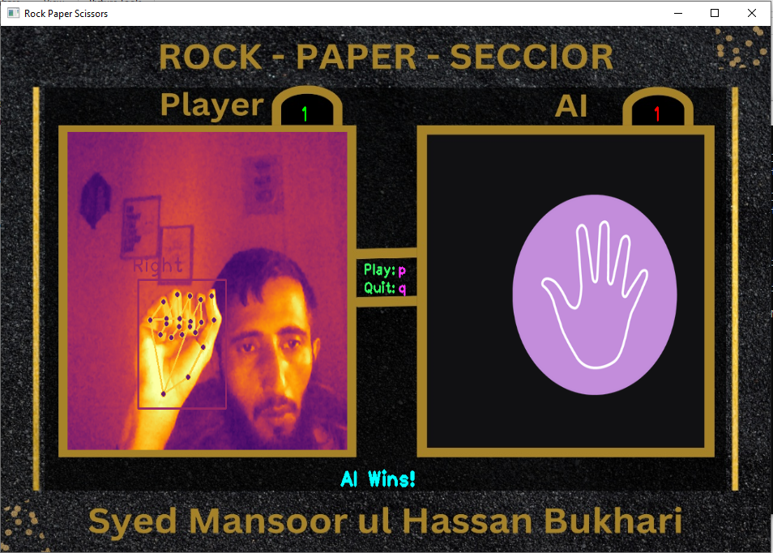
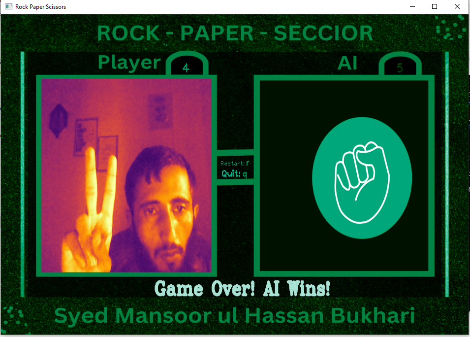

# Rock-Paper-Vision

Welcome to **Rock-Paper-Vision**, a computer vision-based implementation of the classic Rock-Paper-Scissors game. This project uses OpenCV and CvZone's Hand Tracking Module to recognize hand gestures, enabling players to compete against an AI in real time.

---

## ScreenShots
<div style="display: flex; justify-content: space-between;">
  
  
  
</div>

<div style="display: flex; justify-content: space-between;">
  
  
  
</div>

---

## Features
- **Real-time hand tracking**: Detects gestures using your webcam.
- **AI opponent**: AI makes random moves for competitive gameplay.
- **Interactive UI**: Displays live scores and visual feedback with a custom background.
- **Hand gestures supported**:
  - **Rock**: All fingers folded.
  - **Paper**: All fingers open.
  - **Scissors**: Only index and middle fingers open.

---

## How It Works
1. **Hand Tracking**:
   - Uses `cvzone.HandTrackingModule` for detecting and interpreting hand gestures.
2. **Gameplay**:
   - Recognizes the player's gesture.
   - Generates a random AI move.
   - Compares gestures to determine the winner based on traditional rules:
     - Rock beats Scissors.
     - Scissors beats Paper.
     - Paper beats Rock.
3. **Scoring**:
   - Updates and displays the score for both player and AI in real time.
   - Visual feedback enhances the game experience.

---

## Installation and Setup
### Requirements
- **Python 3.8 or higher**
- **Libraries** (install via `pip`):
  ```bash
  pip install opencv-python cvzone
  ```

### Steps
#### Clone This Repository
```
  git clone https://github.com/cyberfantics/Rock-Paper-Vision.git
  cd Rock-Paper-Vision
```
#### Run File Using
```python main.py```

---

# Controls
- **Play:** Press `P` to start the game.
- **Quit:** Press `Q` to exit the game.
- **Restart:** Press `R` to restart the game.
- **Record Game:** Press `S` to record the Game.
- **Open Camera:** Press `C` to Open Camera.
- **Record Game:** Press `I` to See Instructions Of Game.
---

## Video Demo
Check out the gameplay video on YouTube:

[](https://www.youtube.com/watch?v=imOyABws1ro)

---

# Author
**Syed Mansoor ul Hassan Bukhari**  
[GitHub](https://github.com/cyberfantics) | [LinkedIn](https://www.linkedin.com/in/mansoor-bukhari/)

---

Enjoy the game! 🎮
